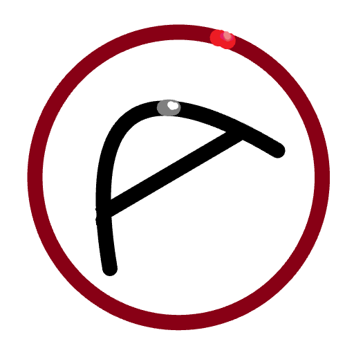

<!DOCTYPE html>
<html lang="ru">
<head>
<meta charset="UTF-8">
<meta name="viewport" content="width=device-width, initial-scale=1, maximum-scale=1, user-scalable=no, viewport-fit=cover">
<link rel="icon" href="img/logo.png">
<title>Эни Блок — 2D строительная сражалка</title>

</head>
<body>

  
<button id="logout">Выйти</button>

  
🪙 0

  <button id="setBtn">⚙ Настройки</button>
  
  <canvas class="charPrev" id="prevCv" width="150" height="170"></canvas>
  <h1>ЭНИ <b>БЛОК</b></h1>
  

    <button class="primary" id="btnPlay">⚔ Играть — строительная сражалка</button>
    <button id="btnSand">🧱 Песочница</button>
    <button id="btnOnline">🌐 Онлайн</button>
    <button id="btnShop">🛍 Каталог и кастомизация</button>
    <button id="btnStudio">🛠 Студия</button>
    <button id="btnExpo">🏆 Выставка игр</button>
  

  <canvas id="cv"></canvas>
  
  

    <button id="btnBack">← Меню</button>
    <button id="btnFS" title="Во весь экран">⛶</button>
    🪙 0
    🌐 1
    <input id="chatIn" class="hidden" placeholder="чат Enter…" style="width:150px">
  

  

  
A/D — движение · Пробел — прыжок · S — слэм · 1-6 — инструменты · ЛКМ (держать) — использовать · ПКМ (держать) — ломать

  

  

    
<button data-action="left">◀</button><button data-action="right">▶</button>

    
<button data-action="place">🧱</button><button data-action="brk">⛏</button><button data-action="down">⤓</button><button data-action="jump">⤒</button>

  

  

  
<button id="shBack">← Меню</button><b>🛍 КАТАЛОГ</b>

  
Эникойны 🪙 даются за убийства в сражалке. Футболки и шапки — ваши фото.

  
👕 Футболки

  

  
🎩 Шапки

  

  
  

    <button id="stBack">← Меню</button><b>СТУДИЯ</b>
    <input id="pName" value="Моя игра" style="width:140px">
    <button id="pTest">Тест</button><button id="pSave">Сохранить</button><button class="primary" id="pPub">Опубликовать</button>
  

  

    <button data-tab="map" class="sel">🗺 Конструктор</button>
    <button data-tab="scr">📜 ЭниЯзык / JS</button>
    <button data-tab="les">🎓 Уроки</button>
    <button data-tab="css">🎨 Моделинг (CSS)</button>
    <button data-tab="gui">🖥 GUI (HTML)</button>
  

  

    

    
<button id="edNew">Новый мир</button><button id="edLoad">Загрузить текущий</button>ЛКМ — блок, ПКМ — стереть

    
<canvas id="edCv"></canvas>

  

  

    

      <select id="langSel"><option value="any">ЭниЯзык (свой язык)</option><option value="js">JavaScript</option></select>
      <button id="scrCheck">Проверить</button>
    

    
ЭниЯзык: события <code>клик:</code> и <code>тик:</code>, команды: взрыв R · частицы N цвет · поставь DX DY блок · ломай DX DY · ракета VX VY · гравитация V · чат "текст" · прыжок · если близко N: …

    <textarea id="scrTxt" style="flex:1" spellcheck="false"></textarea>
  

  

    

  

  

    
<select id="cssBlock"></select><button id="cssApply">Применить к игре</button>

    <textarea id="cssTxt" style="height:140px" spellcheck="false">background:linear-gradient(#6fd35a,#8a5a2b);
border:3px solid #00000033;
border-radius:4px;</textarea>
    

  

  

    
HTML вашего GUI. Кнопки с data-action: left, right, jump, down, tool1..tool6, place, brk.

    <textarea id="guiTxt" style="flex:1" spellcheck="false">

  <button data-action="jump" style="width:80px;height:80px;border-radius:50%;background:#ffd23e;font-size:20px">ПРЫГ</button>

</textarea>
  

  
<button id="exBack">← Меню</button><b>🏆 ВЫСТАВКА ИГР</b>только после регистрации

  

  

    
Google

    
Вход в Эни Блок

    <input id="authName" placeholder="Ваше имя">
    <input id="authMail" placeholder="you@gmail.com">
    <button class="g" id="authGo">Войти через Google</button>
    
Демо-режим: аккаунт локально. Для настоящего OAuth вставьте Client ID в Настройках.

    <button id="authCancel" style="background:#f1f3f4;color:#202124">Отмена</button>
  

  

    <b>⚙ Настройки</b>
    <label style="font-size:13px">Комната онлайн:<input id="setRoom" placeholder="main"></label>
    <label style="font-size:13px">Google Client ID:<input id="setGid" placeholder="xxxx.apps.googleusercontent.com"></label>
    <label style="font-size:13px">Свой сервер (HTTP), необязательно:<input id="setUrl" placeholder="http://localhost:8080"></label>
    <button class="primary" id="setSave">Сохранить</button>
    <button id="setClose" style="background:#f1f3f4;color:#202124">Закрыть</button>
  

</body>
</html>
